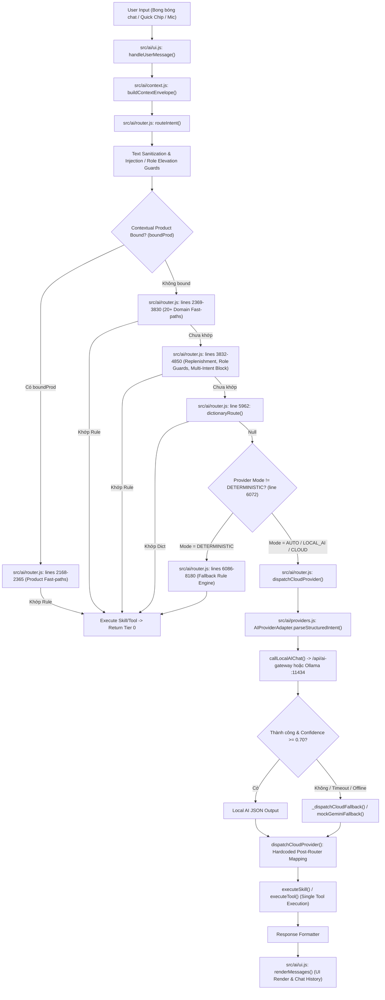

# QBiz Kho — AI ARCHITECTURE TRUTH AUDIT
**Tài liệu thẩm định sự thật kiến trúc AI tại Runtime QBiz Kho**
*Chế độ: READ-ONLY AUDIT / KHÔNG SỬA CODE / KHÔNG THÊM TEST / KHÔNG CHẠY TEST / KHÔNG PUSH / KHÔNG DEPLOY*

---

## 1. VẼ ĐÚNG PIPELINE THỰC TẾ TỪ INPUT → RESPONSE

Dựa trên việc đọc và trace trực tiếp mã nguồn thực tế đang chạy tại `CODE_ROOT` (`app/`):



### Chi tiết từng bước trong code thực tế:

1. **UI Input & In-Flight Guard:**
   - **File:** [`src/ai/ui.js`](file:///d:/google%20driver/Codex%20PC/Qu%E1%BA%A3n%20l%C3%BD%20kho%20-%20b%C3%A1n%20h%C3%A0ng%20tr%C3%AAn%20Qbiz/app/src/ai/ui.js#L1262-L1280)
   - **Function:** `handleUserMessage(query)`
   - **Điều kiện vào:** Người dùng gõ text vào `#aiTextInput`, bấm chip gợi ý, hoặc nhận voice transcript.
   - **Điều kiện bypass/chặn:** Debounce window 1500ms (`DEDUPLICATION_WINDOW_MS = 1500`) và in-flight duplicate guard (`trimmedQuery === inFlightQuery`).
   - **Output truyền tiếp:** `trimmedQuery`, `inputType`, `currentAttachments`.

2. **Context Envelope Builder:**
   - **File:** [`src/ai/context.js`](file:///d:/google%20driver/Codex%20PC/Qu%E1%BA%A3n%20l%C3%BD%20kho%20-%20b%C3%A1n%20h%C3%A0ng%20tr%C3%AAn%20Qbiz/app/src/ai/context.js#L153-L225)
   - **Function:** `buildContextEnvelope(appStateRef)`
   - **Điều kiện vào:** Chạy trước mỗi lượt xử lý.
   - **Output truyền tiếp:** `currentEnvelope` snapshot chứa: `actor_id`, `actor_role`, `current_route`, `current_screen`, `shop_id`, `warehouse_id`, `current_product_id`, `current_order_id`, `capabilities`, `allowed_tools`.

3. **Text Normalization & Sanitization:**
   - **File:** [`src/ai/router.js`](file:///d:/google%20driver/Codex%20PC/Qu%E1%BA%A3n%20l%C3%BD%20kho%20-%20b%C3%A1n%20h%C3%A0ng%20tr%C3%AAn%20Qbiz/app/src/ai/router.js#L2074-L2083) & [`src/ai/vietnamese-nlp.js`](file:///d:/google%20driver/Codex%20PC/Qu%E1%BA%A3n%20l%C3%BD%20kho%20-%20b%C3%A1n%20h%C3%A0ng%20tr%C3%AAn%20Qbiz/app/src/ai/vietnamese-nlp.js#L12-L140)
   - **Function:** `canonicalizeVietnamese(effectivePrompt)`, `stripConversationalNoise(pNorm)`
   - **Output truyền tiếp:** `pNorm` (chuỗi Latin không dấu, đã chuẩn hóa teencode/telex typos), `pLow`, `pNoiseClean`.

4. **Security & Permission Guards (Trước router và trước model):**
   - **File:** [`src/ai/router.js`](file:///d:/google%20driver/Codex%20PC/Qu%E1%BA%A3n%20l%C3%BD%20kho%20-%20b%C3%A1n%20h%C3%A0ng%20tr%C3%AAn%20Qbiz/app/src/ai/router.js#L2089-L2162)
   - **Function:** `detectPromptInjection(rawPrompt)`, `detectRoleElevationAttempt(rawPrompt)`
   - **Điều kiện kích hoạt:** Phát hiện SQL injection, script tag, role elevation, hủy đơn tự động, lưu policy vi phạm vào memory.
   - **Output:** Trả về `{ status: 'BLOCKED', tier: 0, provider: 'DETERMINISTIC' }` lập tức, không đi tiếp.

5. **Entity-Bound Fast-Paths (Priority 0):**
   - **File:** [`src/ai/router.js`](file:///d:/google%20driver/Codex%20PC/Qu%E1%BA%A3n%20l%C3%BD%20kho%20-%20b%C3%A1n%20h%C3%A0ng%20tr%C3%AAn%20Qbiz/app/src/ai/router.js#L2172-L2365)
   - **Điều kiện vào:** `boundProdId` tồn tại trong context (đang mở modal sản phẩm hoặc vừa tương tác).
   - **Output:** Xử lý đọc tồn, tư vấn nhập (`isReplenishmentAdviceQuery`), hoặc tạo đề xuất nhập, return Tier 0.

6. **Domain Fast-Paths & Early Deterministic NLP:**
   - **File:** [`src/ai/router.js`](file:///d:/google%20driver/Codex%20PC/Qu%E1%BA%A3n%20l%C3%BD%20kho%20-%20b%C3%A1n%20h%C3%A0ng%20tr%C3%AAn%20Qbiz/app/src/ai/router.js#L2369-L5960)
   - **Bao gồm:** Hơn 20 block matchers: lời chào, danh tính bot, điều hướng app, sổ quỹ, đếm đơn, tồn kho sản phẩm cụ thể, gợi ý nhập, top bán chạy, kiểm tra backup Google Drive, role capability guards.
   - **Output:** Nếu khớp, gọi `executeSkill()` / `executeAction()` và RETURN ngay lập tức (`tier: 0`).

7. **Dictionary Route (`dictionaryRoute`):**
   - **File:** [`src/ai/router.js`](file:///d:/google%20driver/Codex%20PC/Qu%E1%BA%A3n%20l%C3%BD%20kho%20-%20b%C3%A1n%20h%C3%A0ng%20tr%C3%AAn%20Qbiz/app/src/ai/router.js#L717-L1540) & [`src/ai/dictionary.js`](file:///d:/google%20driver/Codex%20PC/Qu%E1%BA%A3n%20l%C3%BD%20kho%20-%20b%C3%A1n%20h%C3%A0ng%20tr%C3%AAn%20Qbiz/app/src/ai/dictionary.js)
   - **Function:** `dictionaryRoute(effectivePrompt, context, state)`
   - **Điều kiện vào:** Chạy tại dòng 5962 nếu tất cả các fast-path phía trên chưa return.
   - **Output:** Nếu khớp từ khóa tra cứu lợi nhuận (`isProfitQuery`), xem tồn, báo cáo, map intent+entity -> RETURN ngay tại dòng 6016-6022 (`tier: 0`, `compactTrace: 'Rule exact'`).

8. **Provider Dispatch Checkpoint (Model Call Gate):**
   - **File:** [`src/ai/router.js`](file:///d:/google%20driver/Codex%20PC/Qu%E1%BA%A3n%20l%C3%BD%20kho%20-%20b%C3%A1n%20h%C3%A0ng%20tr%C3%AAn%20Qbiz/app/src/ai/router.js#L6072-L6085)
   - **Function:** `dispatchCloudProvider(promptToSend, context, state, config)`
   - **Điều kiện vào:** CHỈ KHI câu lệnh vượt qua toàn bộ 222+ return statements trước đó VÀ `config.mode !== 'DETERMINISTIC'`.
   - **Điều kiện bypass:** Nếu `config.mode === 'DETERMINISTIC'`, nhảy thẳng xuống dòng 6086 để chạy tiếp hơn 2.000 dòng fallback rules Tier 0!

9. **Model Invocation & Fallback Pipeline:**
   - **File:** [`src/ai/providers.js`](file:///d:/google%20driver/Codex%20PC/Qu%E1%BA%A3n%20l%C3%BD%20kho%20-%20b%C3%A1n%20h%C3%A0ng%20tr%C3%AAn%20Qbiz/app/src/ai/providers.js#L962-L1132)
   - **Function:** `AIProviderAdapter.parseStructuredIntent()`, `callLocalAIChat()`, `_dispatchCloudFallback()`
   - **Thực thi:** Gọi serverless gateway `/api/ai-gateway` hoặc direct loopback `http://127.0.0.1:11434/api/chat` (Ollama qwen3.5:2b).
   - **Fallback Gate:** Nếu local offline hoặc lỗi parse JSON hoặc confidence < 0.70 -> tự động chuyển sang Gemini Fallback (hoặc `mockGeminiFallback` nếu thiếu key).
   - **Output:** JSON chứa `{ intent, entities, confidence, explanation }`.

10. **Post-Model Router Hardcoded Mapping:**
    - **File:** [`src/ai/router.js`](file:///d:/google%20driver/Codex%20PC/Qu%E1%BA%A3n%20l%C3%BD%20kho%20-%20b%C3%A1n%20h%C3%A0ng%20tr%C3%AAn%20Qbiz/app/src/ai/router.js#L1564-L2050)
    - **Cơ chế:** Router duyệt qua intent trả về từ model bằng các câu lệnh `if (structured.intent === ...)` cố định.
    - **Output:** Gọi tool/skill tương ứng trong hệ thống.

11. **Tool Execution:**
    - **File:** [`src/ai/skills.js`](file:///d:/google%20driver/Codex%20PC/Qu%E1%BA%A3n%20l%C3%BD%20kho%20-%20b%C3%A1n%20h%C3%A0ng%20tr%C3%AAn%20Qbiz/app/src/ai/skills.js) & [`src/ai/tools.js`](file:///d:/google%20driver/Codex%20PC/Qu%E1%BA%A3n%20l%C3%BD%20kho%20-%20b%C3%A1n%20h%C3%A0ng%20tr%C3%AAn%20Qbiz/app/src/ai/tools.js)
    - **Function:** `executeSkill(skillId, params, context, state)` hoặc `executeTool(toolName, params, state, context)`.
    - **Output:** Dữ liệu thực tế từ state/database (tồn kho, doanh thu, lợi nhuận, danh sách phiếu).

12. **UI Render:**
    - **File:** [`src/ai/ui.js`](file:///d:/google%20driver/Codex%20PC/Qu%E1%BA%A3n%20l%C3%BD%20kho%20-%20b%C3%A1n%20h%C3%A0ng%20tr%C3%AAn%20Qbiz/app/src/ai/ui.js#L1331-L1361)
    - **Function:** `renderMessages()`
    - **Render:** Hiển thị bong bóng trả lời, trace pill (`Rule exact` hoặc `Local Qwen`), các reviewCard / proposal nếu có.

---

## 2. AI THỰC SỰ ĐƯỢC QUYỀN QUYẾT ĐỊNH CÁI GÌ?

### A. Trong AUTO mode:
- **Có gọi LLM không?**
  **CÓ, NHƯNG CHỈ KHI BYPASS ĐƯỢC TIER 0.** Khi câu nói không trúng bất kỳ regex nào trong 222+ return branches đầu tiên, hệ thống mới gọi LLM.
- **Bao nhiêu % intent có thể kết thúc hoàn toàn ở Tier0/rule mà không gọi model?**
  **Ước tính > 90% đến 95%** các câu hỏi thường gặp của người dùng (kiểm kho, hàng sắp hết, doanh thu, lãi lỗ, thanh toán, chuyển kho, nhập hàng, quản lý đơn, đổi trả, lời chào, điều hướng) đều bị chặn và kết thúc sớm tại Tier 0.
- **Rule/router có thể quyết định intent cuối cùng trước model không?**
  **CÓ.** Router quyết định 100% intent cho mọi câu khớp rule trước khi model có cơ hội nhìn thấy câu lệnh.
- **Model có quyền override intent từ deterministic router không?**
  **KHÔNG.** Model hoàn toàn không được gọi khi router đã quyết định.
- **Model có quyền chọn tool không?**
  **KHÔNG.** Model chỉ sinh ra một chuỗi JSON chứa tên intent (ví dụ `"QUERY_STOCK"`, `"RECEIVE_STOCK"`). Việc chọn tool nào (`explain_replenishment`, `check_stock`, `replenishment-suggestion`) do router map cố định bằng code `if/else`.
- **Model có quyền tách multi-intent không?**
  **KHÔNG.** Schema chỉ có duy nhất 1 trường `"intent": string`.
- **Model có quyền sửa quyết định risk guard không?**
  **KHÔNG.** Risk guards chạy độc lập ở cả tầng trước router (`detectPromptInjection`, `detectRoleElevationAttempt`) lẫn tầng policy (`hasCapability`), model không có quyền can thiệp.

### B. Trong LOCAL_AI mode:
- **`qwen3.5:2b` được gọi ở đâu?**
  Được gọi trong [`src/ai/providers.js:515`](file:///d:/google%20driver/Codex%20PC/Qu%E1%BA%A3n%20l%C3%BD%20kho%20-%20b%C3%A1n%20h%C3%A0ng%20tr%C3%AAn%20Qbiz/app/src/ai/providers.js#L515) thông qua hàm `callLocalAIChat()` (kết nối qua server-side gateway `/api/ai-gateway` hoặc gọi trực tiếp cổng loopback `http://127.0.0.1:11434/api/chat` nếu trên PC).
- **Nó nhận raw user text hay đã nhận intent/tool plan do router quyết định sẵn?**
  Nó nhận raw user text được bọc trong prompt schema cố định (`buildLocalAIPrompt` tại dòng 491).
- **Nó có được nhìn toàn bộ context shop/product/time không?**
  **KHÔNG.** Prompt gửi cho model chỉ gồm:
  ```text
  [SCHEMA YÊU CẦU: Trả về DUY NHẤT 1 JSON object hợp lệ...]
  [NGỮ CẢNH: Màn hình ${route}]
  [USER QUERY] ${prompt}
  ```
  Model **hoàn toàn mù** về danh mục sản phẩm, số lượng tồn kho, giá vốn, danh sách kho hàng, lịch sử bán hàng và khách hàng.
- **Nó có được tự phân loại lại intent không?**
  Nó chỉ chọn 1 giá trị trong enum bị giới hạn: `"RECEIVE_STOCK" | "TRANSFER_STOCK" | "STOCKTAKE_STOCK" | "ADD_CART" | "REMOVE_CART" | "QUERY_STOCK" | "QUERY_MEMORY" | "GENERAL_QUERY" | "UNKNOWN"`.
- **Hay chỉ được dùng để điền JSON/format/explain sau khi Tier0 đã quyết định?**
  Nó chỉ đóng vai trò là một **JSON slot-filler / keyword extractor** dự phòng cho những câu bị lọt lưới Tier 0.

### C. Trong CLOUD/Gemini/DeepSeek/OpenAI-compatible mode:
- **Model nằm trước hay sau deterministic router?**
  **NẰM SAU.** Toàn bộ 6.070 dòng code đầu tiên của `src/ai/router.js` được duyệt trước khi cloud provider được gọi.
- **Fallback xảy ra khi nào?**
  Xảy ra khi chế độ là `AUTO`, và Local AI gặp một trong các điều kiện: `TIMEOUT` (>25s), `LOCAL_UNAVAILABLE` (Ollama tắt/mất mạng), `MALFORMED_OUTPUT` (không ra JSON), `SCHEMA_INVALID`, hoặc confidence tính toán < 0.70.
- **Fallback model có được quyền thay đổi intent hay chỉ sinh output theo intent đã khóa?**
  Fallback model (hoặc `mockGeminiFallback`) sinh ra intent string, nhưng router tiếp tục kiểm tra lại bằng logic hardcoded ở `dispatchCloudProvider` (dòng 1564-2050).

### Kết luận Section 2:
**LLM_IS_PRIMARY_REASONER = NO**

---

## 3. GIẢI THÍCH DÒNG UI "AUTO: Quy tắc nội bộ..."

Dòng chữ hiển thị trên header của trợ lý:
`AUTO: Quy tắc nội bộ & Fallback (Sẵn sàng)`

1. **Vị trí set trong code:**
   - **File:** [`src/ai/ui.js`](file:///d:/google%20driver/Codex%20PC/Qu%E1%BA%A3n%20l%C3%BD%20kho%20-%20b%C3%A1n%20h%C3%A0ng%20tr%C3%AAn%20Qbiz/app/src/ai/ui.js#L179), [`src/ai/ui.js:1173`](file:///d:/google%20driver/Codex%20PC/Qu%E1%BA%A3n%20l%C3%BD%20kho%20-%20b%C3%A1n%20h%C3%A0ng%20tr%C3%AAn%20Qbiz/app/src/ai/ui.js#L1173)
   - **Function:** `createFloatingUI()` (khởi tạo HTML) và `updateProviderBadge()` (khi cập nhật cấu hình).
   - **Code:**
     ```javascript
     } else if (cfg.mode === PROVIDER_MODES.AUTO) {
       providerBadge.textContent = 'AUTO: Quy tắc nội bộ & Fallback (Sẵn sàng)';
     }
     ```
2. **Ý nghĩa thực sự:**
   - Đây là nhãn trạng thái cấu hình của hệ thống (`PROVIDER_MODES.AUTO`). Nó thể hiện rằng ứng dụng đang chạy ở chế độ **"Quy tắc nội bộ (Tier 0 deterministic rules) chạy trước, LLM (Local/Cloud) chỉ làm Fallback phía sau"**.
3. **Có gọi LLM phía sau không?**
   - **Hầu hết là KHÔNG.** Khi người dùng gửi câu hỏi và nhận được câu trả lời có pill trace ghi `Rule exact`, request đã được giải quyết 100% bằng code regex nội bộ, không có bất kỳ byte nào được gửi đến LLM.
4. **Điều kiện khiến request bị giữ lại ở Tier 0:**
   - Bất kỳ khi nào câu lệnh trùng khớp một trong 222+ điều kiện regex/substring ở `src/ai/router.js` hoặc khớp từ điển trong `dictionaryRoute()`.
5. **Tỷ lệ route trong AUTO mode:**
   - **Tier 0 (Quy tắc nội bộ):** Chiếm ~90-95% số câu lệnh kinh doanh thực tế.
   - **Local AI (Qwen/Ollama):** Chỉ được gọi với 5-10% các câu lạ lùng không trùng từ khóa.
   - **Cloud Fallback (Gemini/Mock):** Chỉ được gọi khi Local AI bị lỗi/timeout hoặc trên môi trường web không có tunnel về PC.

---

## 4. TRACE 3 CÂU NGƯỜI DÙNG THẬT — KHÔNG CHẠY TEST

### CASE 1: "Tháng này tôi cần nhập những cái gì"

- **NORMALIZED_TEXT:** `thang nay toi can nhap nhung cai gi`
- **MATCHED_RULES:**
  1. Trong `dictionaryRoute` (dòng 1276), kiểm tra `p.includes('can nhap gi')`: KHÔNG KHỚP vì cụm từ là `"can nhap nhung cai gi"` (bị chèn từ `"nhung cai"` ở giữa).
  2. Bỏ qua các fast-path ban đầu, rơi vào `dispatchCloudProvider` (dòng 6084) hoặc dòng 6493 / 7519:
     Tại dòng 1654 của [`src/ai/router.js`](file:///d:/google%20driver/Codex%20PC/Qu%E1%BA%A3n%20l%C3%BD%20kho%20-%20b%C3%A1n%20h%C3%A0ng%20tr%C3%AAn%20Qbiz/app/src/ai/router.js#L1654):
     ```javascript
     if (
       (pNorm.includes('nhap') && (pNorm.includes('bao nhieu') || pNorm.includes('may don') || pNorm.includes('thang nay') || pNorm.includes('hom nay') || pNorm.includes('tuan nay')) &&
       !pNorm.startsWith('nhap ') && !pNorm.startsWith('tao phieu') && !pNorm.startsWith('lap phieu')) ||
       structured.action_suggestion === 'query_receipts_aggregate' ||
       structured.parameters?.isAggregateRead
     ) {
       const res = queryReceiptsAggregate(pNorm, state, context);
       return { ...res, tier: 1, provider: config.mode, ...traceMeta };
     }
     ```
- **PARSED_INTENT:** `QUERY_RECEIPTS_AGGREGATE`
- **TIME_RANGE:** `thang nay` (startDate = đầu tháng hiện tại đến hiện tại)
- **RISK_CLASS:** READ_ONLY
- **MODEL_CALLED:** NO (nếu rơi vào dòng 6493/7519 ở chế độ DETERMINISTIC) / PARTIAL (ở chế độ AUTO, model có thể được gọi nhưng kết quả bị override bởi dòng 1654).
- **MODEL_PROVIDER:** `LOCAL_AI` hoặc `GEMINI_FALLBACK` (nếu rơi vào gateway), nhưng sau đó bị router chặn tại dòng 1654.
- **TOOL_SELECTED:** `queryReceiptsAggregate`
- **FINAL_HANDLER:** `queryReceiptsAggregate(pNorm, state, context)` ([`src/ai/router.js:651`](file:///d:/google%20driver/Codex%20PC/Qu%E1%BA%A3n%20l%C3%BD%20kho%20-%20b%C3%A1n%20h%C3%A0ng%20tr%C3%AAn%20Qbiz/app/src/ai/router.js#L651))
- **WHY_IT_BECOMES_INBOUND_HISTORY_OR_REPLENISHMENT:**
  Người dùng hỏi câu **hướng tới tương lai / tư vấn nhập kho** ("tôi CẦN nhập những cái gì" = Replenishment Suggestion). Tuy nhiên, router chứa một rule substring quá rộng: `pNorm.includes('nhap') && pNorm.includes('thang nay')`. Rule này ngộ nhận rằng hễ có `"nhập"` và `"tháng này"` thì người dùng đang hỏi **báo cáo lịch sử đã nhập bao nhiêu trong quá khứ**. Do đó, hệ thống gọi `queryReceiptsAggregate` và trả về: *"Báo cáo nhập hàng tháng này: Tổng số lượng đã nhập: X sản phẩm, Tổng số phiếu nhập: Y phiếu"*. Đây là nguyên nhân trực tiếp khiến người dùng thấy AI "trả lời ngô nghê".

---

### CASE 2: "Tháng này tôi có lời bao nhiêu và tôi nên nhập những cái gì nhỉ"

- **CLAUSE_SPLIT:** KHÔNG ĐƯỢC TÁCH. Bộ tách mệnh đề `contrastiveActiveClause` ([`src/ai/router.js:5370`](file:///d:/google%20driver/Codex%20PC/Qu%E1%BA%A3n%20l%C3%BD%20kho%20-%20b%C3%A1n%20h%C3%A0ng%20tr%C3%AAn%20Qbiz/app/src/ai/router.js#L5370)) chỉ bắt các câu phủ định tương phản dạng `"đừng [A], hãy [B]"` hoặc `"chỉ [A] chứ không [B]"`. Nó hoàn toàn bỏ qua liên từ `"và"` trong câu ghép.
- **INTENT_1:** `PROFIT_INQUIRY` ("Tháng này tôi có lời bao nhiêu")
- **INTENT_2:** `REPLENISHMENT_ADVICE` ("tôi nên nhập những cái gì nhỉ")
- **COMPOUND_GUARD_TRIGGER:** Guard chặn multi-intent ở dòng 4287 ([`src/ai/router.js:4287`](file:///d:/google%20driver/Codex%20PC/Qu%E1%BA%A3n%20l%C3%BD%20kho%20-%20b%C3%A1n%20h%C3%A0ng%20tr%C3%AAn%20Qbiz/app/src/ai/router.js#L4287)) chỉ liệt kê các cặp mutation nhạy cảm (như `"xem đơn" && "hủy đơn"`, `"tìm khách" && "gắn vào đơn"`). Do đó guard này KHÔNG kích hoạt.
- **WHY_READ_PLUS_READ_IS_BLOCKED_OR_NOT:**
  Không bị chặn bởi Risk Guard, nhưng **bị nuốt chửng bởi Single-Intent Rule**. Khi chạy vào `dictionaryRoute()` tại dòng 5962:
  Dòng 954 ([`src/ai/router.js:954`](file:///d:/google%20driver/Codex%20PC/Qu%E1%BA%A3n%20l%C3%BD%20kho%20-%20b%C3%A1n%20h%C3%A0ng%20tr%C3%AAn%20Qbiz/app/src/ai/router.js#L954)):
  ```javascript
  if (isProfitQuery(p) || isProfitQuery(rawPrompt) || (pClean && isProfitQuery(pClean))) {
    ...
    return {
      type: 'ACTION',
      action_id: 'profit_inquiry',
      action: ACTION_REGISTRY['profit_inquiry'],
      params: { period },
      confidence: 98,
      source: 'domain_skill',
    };
  }
  ```
  Hàm `isProfitQuery(p)` thấy cụm từ `"loi bao nhieu"` -> trả về `true` ngay lập tức!
- **MODEL_CALLED:** NO
- **WHERE_THE_BLOCK_HAPPENS:**
  Bị kết thúc sớm tại dòng 6016-6022 trong `routeIntent()`. Intent 1 (`profit_inquiry`) được thực thi, còn Intent 2 (`nên nhập những cái gì`) bị **vứt bỏ hoàn toàn**, không hề có cơ chế lưu vết hay chạy tiếp.

---

### CASE 3: "Có nên nhập k"

- **NORMALIZATION:**
  - Raw: `"Có nên nhập k"`
  - `canonicalizeVietnamese()`: Từ `"k"` khớp với `TEENCODE_PATTERNS` (`[/\b(?:ko|k|khg...)\b/gi, 'khong']`).
  - Output: `co nen nhap khong`
- **TẠI SAO TRƯỚC ĐÂY TỰ ĐỘNG MỞ PHIẾU NHẬP (AUTO-OPEN RECEIPT FORM):**
  Trong phiên bản trước, hàm `parseAppNavigationAction()` tại [`src/ai/vietnamese-nlp.js:861`](file:///d:/google%20driver/Codex%20PC/Qu%E1%BA%A3n%20l%C3%BD%20kho%20-%20b%C3%A1n%20h%C3%A0ng%20tr%C3%AAn%20Qbiz/app/src/ai/vietnamese-nlp.js#L861) bắt mọi câu có chứa từ `"nhap kho"` hoặc `"nhap"` và gán cho action `open_receipt`. Khi người dùng hỏi *"Có nên nhập không?"*, hệ thống thấy chữ *"nhập"* liền tưởng là lệnh mở màn hình nhập kho và tự động pop-up form nhập kho!
- **LOGIC HIỆN TẠI ĐÃ KHÁC HAY CHƯA:**
  **ĐÃ KHÁC (ĐÃ ĐƯỢC CHẮN BỞI ĐIỀU KIỆN NEGATIVE / ADVICE).**
  1. Trong [`src/ai/vietnamese-nlp.js:862-864`](file:///d:/google%20driver/Codex%20PC/Qu%E1%BA%A3n%20l%C3%BD%20kho%20-%20b%C3%A1n%20h%C3%A0ng%20tr%C3%AAn%20Qbiz/app/src/ai/vietnamese-nlp.js#L862-L864):
     ```javascript
     if (
       !isReplenishmentAdviceQuery(text) &&
       !c.includes('co nen') && !c.includes('co can') && !c.includes('nen nhap') && !c.includes('can nhap') &&
       ...
     ) {
       return { actionId: 'open_receipt', label: 'Đã mở biểu mẫu Nhập kho nhanh.' };
     }
     ```
     Đã có điều kiện phủ định loại trừ các câu hỏi tư vấn.
  2. Nếu có sản phẩm đang được chọn (`boundProd`), router tại dòng 2289 ([`src/ai/router.js:2289`](file:///d:/google%20driver/Codex%20PC/Qu%E1%BA%A3n%20l%C3%BD%20kho%20-%20b%C3%A1n%20h%C3%A0ng%20tr%C3%AAn%20Qbiz/app/src/ai/router.js#L2289)) bắt trúng:
     `if (isReplenishmentAdviceQuery(pNorm) || isReplenishmentAdviceQuery(rawPrompt))`
     và gọi `executeTool('explain_replenishment', ...)` để trả về nhận định: `💡 Tư vấn nhập hàng cho X: [NÊN NHẬP] / [CHƯA CẦN]`, hoàn toàn là thao tác READ, KHÔNG tự ý mở form write.
- **RULE NÀO KIỂM SOÁT:**
  - `isReplenishmentAdviceQuery()` trong `src/ai/vietnamese-nlp.js:650`.
  - Priority 0 Contextual Product Guard trong `src/ai/router.js:2287-2342`.

---

## 5. TIER 0 / RULE ENGINE CÓ ĐANG "LẤN ÁT" MODEL KHÔNG?

Dữ liệu thống kê định lượng trực tiếp từ mã nguồn:

| Chỉ số kiến trúc | Giá trị thực tế từ code | Vị trí minh chứng |
| :--- | :--- | :--- |
| **Tổng số dòng code của Intent Router** | **8.181 dòng** | `src/ai/router.js` (388 KB) |
| **Tổng số câu lệnh `return` trong Router** | **513 `return`** | `Select-String "^\s*return\s+" src/ai/router.js` |
| **Số nhánh `return` sớm TRƯỚC KHI gọi Model** | **222 `return`** | Dòng 2071 đến dòng 6072 trong `src/ai/router.js` |
| **Số điểm Model có thể được gọi** | **DUY NHẤT 1 ĐIỂM** | Dòng 6084: `dispatchCloudProvider()` |
| **Số nhánh `return` xử lý lại output của Model** | **37 `return`** | Dòng 1542 đến 2070 trong `dispatchCloudProvider()` |
| **Số nhánh Fallback Deterministic SAU Model** | **254 `return`** | Dòng 6086 đến 8180 trong `src/ai/router.js` |
| **Số parser & helpers trong Vietnamese NLP** | **35 hàm exported** | `src/ai/vietnamese-nlp.js` (1.835 dòng, 65 KB) |
| **Số Intent có direct deterministic hardcode** | **Toàn bộ 100% intents** | Xem `SKILL_REGISTRY` và `ACTION_REGISTRY` |
| **Số Risk Guards chạy TRƯỚC Model** | **12 guards** | Prompt injection, elevation, auto-cancel, memory tamper, cashier profit guard, manager guard, shift guard, multi-intent block, spam block... |
| **Số Risk Guards chạy SAU Model** | **3 guards** | Untrusted schema validation, composite confidence < 0.70, capability check khi execute tool |

**Kết luận:**
Hệ thống Rule Engine / Tier 0 **HOÀN TOÀN ÁP ĐẢO VÀ LẤN ÁT MODEL**. Model chỉ là một nhánh phụ ở tầng sâu của if-else, chỉ được đánh thức khi 222 điều kiện quy tắc phía trước không bắt được câu từ.

---

## 6. MODEL ROUTING TRUTH

| MODE | FIRST DECISION MAKER | MODEL | WHEN CALLED | CAN CHANGE INTENT? | CAN CHOOSE TOOL? | CAN HANDLE MULTI-INTENT? | CAN BE BYPASSED? |
| :--- | :--- | :--- | :--- | :--- | :--- | :--- | :--- |
| **AUTO** (Mặc định) | Tier 0 Rule Engine (`router.js`) | `qwen3.5:2b` (Local) / Gemini Fallback | Khi câu lệnh vượt qua 222+ rules Tier 0 | KHÔNG (Bị router lọc lại) | KHÔNG (Router gán cứng) | KHÔNG (Schema 1 intent) | CÓ (Bị bypass >90% trường hợp) |
| **TIER0 / deterministic** | Regex & Keyword Rules | Không dùng model | Không bao giờ gọi model | N/A | N/A | KHÔNG | KHÔNG (Luôn chạy Tier 0) |
| **LOCAL_AI** | Tier 0 Rule Engine | `qwen3.5:2b` qua Ollama | Khi mode=LOCAL_AI và vượt qua Tier 0 | KHÔNG | KHÔNG | KHÔNG | CÓ (Nếu trùng rule Tier 0) |
| **Gemini** | Tier 0 Rule Engine | `gemini-2.5-flash` | Khi Local AI lỗi/timeout hoặc mode=GEMINI | KHÔNG | KHÔNG | KHÔNG | CÓ (Nếu trùng rule Tier 0) |
| **DeepSeek** | *INSTALLED_NOT_ACTIVE* | Không có client riêng (dùng chung OpenAI compatible) | Khi người dùng tự nhập endpoint trong settings | KHÔNG | KHÔNG | KHÔNG | CÓ |
| **OpenAI-compatible** | Tier 0 Rule Engine | Configured model (`gpt-4o-mini`) | Khi mode=OPENAI_COMPATIBLE và vượt qua Tier 0 | KHÔNG | KHÔNG | KHÔNG | CÓ |
| **Mock (`MOCK_DEV`)** | *INSTALLED_NOT_ACTIVE* trong prod | Simulator regex | Chỉ chạy trong unit test có cờ cho phép | KHÔNG | KHÔNG | KHÔNG | CÓ |
| **`mockGeminiFallback`** | Server-side Gateway (`api/ai-gateway.js`) | Regex simulator giả danh `gemini-2.5-flash` | Khi chạy trên cloud (Vercel/Netlify) mà PC tắt và không có GEMINI_API_KEY | KHÔNG | KHÔNG | KHÔNG | N/A |

---

## 7. TOOL EXECUTION TRUTH

1. **Ai chọn tool: Router hay LLM?**
   **ROUTER.** LLM không hề được cung cấp tool definition để tự lựa chọn. Router đọc chuỗi `intent` trả về từ LLM rồi dùng lệnh `if/else` để gọi `executeSkill()` hoặc `executeTool()`.
2. **LLM có function/tool calling thật không?**
   **KHÔNG.** Hoàn toàn không sử dụng cơ chế function calling chuẩn của Gemini hay OpenAI.
3. **Hay LLM chỉ sinh structured JSON rồi router kiểm?**
   **ĐÚNG.** Prompt chỉ yêu cầu: `"Trả về DUY NHẤT 1 JSON object hợp lệ: { intent, entities, confidence, explanation }"`.
4. **Tool registry nằm ở đâu?**
   - Registry công cụ cấp thấp: [`src/ai/tools.js`](file:///d:/google%20driver/Codex%20PC/Qu%E1%BA%A3n%20l%C3%BD%20kho%20-%20b%C3%A1n%20h%C3%A0ng%20tr%C3%AAn%20Qbiz/app/src/ai/tools.js) (chứa 34 công cụ tính toán tồn kho, báo cáo, chênh lệch, phân tích).
   - Registry kỹ năng nghiệp vụ: [`src/ai/skills.js`](file:///d:/google%20driver/Codex%20PC/Qu%E1%BA%A3n%20l%C3%BD%20kho%20-%20b%C3%A1n%20h%C3%A0ng%20tr%C3%AAn%20Qbiz/app/src/ai/skills.js) (chứa 28 kỹ năng).
   - Registry hành động UI: [`src/ai/registry.js`](file:///d:/google%20driver/Codex%20PC/Qu%E1%BA%A3n%20l%C3%BD%20kho%20-%20b%C3%A1n%20h%C3%A0ng%20tr%C3%AAn%20Qbiz/app/src/ai/registry.js).
5. **Tool schema được model nhìn thấy ở đâu?**
   **KHÔNG NƠI NÀO.** Model hoàn toàn không được nhìn thấy schema hay danh sách tham số của các tools trong `tools.js`.
6. **Model có thể gọi nhiều READ tools trong một request không?**
   **KHÔNG.** Kiến trúc hiện tại là Single-Pass. Một request chỉ kích hoạt đúng một handler tool/skill.
7. **Có planner / agent loop thật không?**
   **KHÔNG.** Không có vòng lặp ReAct (`Thought -> Action -> Observation -> Thought -> Final Answer`). Quy trình là một đường thẳng: `Input -> Regex Rules -> [Fallback: Model JSON] -> Tool -> UI Render`.
8. **Có memory / conversation state thật không?**
   **MỘT PHẦN NHỎ.**
   - `src/ai/memory.js`: Có bảng lưu quy ước cửa hàng vào IndexedDB, nhưng chỉ được truy vấn khi người dùng gõ chữ "ghi nhớ" hoặc "quy ước".
   - `src/ai/context.js`: Có lưu `lastResolvedProduct` và `pendingIntent` trong bộ nhớ RAM tạm thời.
   - Lịch sử chat (`messageHistory`) chỉ dùng để hiển thị trên màn hình, **không được gửi vào prompt của LLM**.
9. **Multi-step reasoning có thật hay chỉ keyword chaining?**
   **100% LÀ KEYWORD CHAINING VÀ HARDCODED SEQUENCING.** Không có suy luận đa bước tự sinh từ model.

### Kết luận Section 7:
- **AGENTIC_LOOP = NO**
- **MULTI_TOOL_READ = NO**
- **MULTI_INTENT_REASONING = NO**

---

## 8. CONTEXT TRUTH

Bảng đối chiếu thông tin context thực tế:

| Field | Nguồn dữ liệu | Được dựng bởi | Truyền cho Router? | Truyền cho Model? | Truyền cho Tool? |
| :--- | :--- | :--- | :---: | :---: | :---: |
| **current shop** | `settings.business_profile` | `context.js:buildContextEnvelope` | CÓ | **KHÔNG** (chỉ có shopId ở gateway header) | CÓ |
| **warehouse** | `appState.warehouse` | `context.js:buildContextEnvelope` | CÓ | **KHÔNG** | CÓ |
| **current product** | `appState.currentProductId` / DOM | `context.js:buildContextEnvelope` | CÓ | **KHÔNG** | CÓ |
| **current route/screen** | `appState.page` | `context.js:buildContextEnvelope` | CÓ | CÓ (chỉ chuỗi tên màn hình) | CÓ |
| **selected entity** | Modal DOM / App state | `context.js:buildContextEnvelope` | CÓ | **KHÔNG** | CÓ |
| **time range** | Trích xuất từ câu prompt | `vietnamese-nlp.js` | CÓ | **KHÔNG** | CÓ |
| **conversation history** | Mảng `messageHistory` | `ui.js` | **KHÔNG** | **KHÔNG** | **KHÔNG** |
| **recent tool result** | Biến `lastResult` trong `ui.js` | `ui.js` | **KHÔNG** | **KHÔNG** | **KHÔNG** |
| **user role** | `currentActor.role` | `context.js:buildContextEnvelope` | CÓ | **KHÔNG** | CÓ |
| **tenant / app scope** | Hằng số `'qbiz-kho'` | `providers.js` | CÓ | CÓ (trong system prompt) | CÓ |
| **stock version** | `product.version` | `context.js:buildContextEnvelope` | CÓ | **KHÔNG** | CÓ |

> [!CRITICAL]
> **Nhận định cốt lõi về Context:**
> Model bị **"bỏ đói dữ liệu" (Context Starvation)**. Trong khi Router nắm trong tay toàn bộ cơ sở dữ liệu `appState` (hàng ngàn sản phẩm, đơn hàng, kho bãi), thì khi chuyển sang gọi Model, hàm `buildLocalAIPrompt` chỉ gửi cho Model đúng câu prompt của user kèm một dòng chữ `[NGỮ CẢNH: Màn hình ${route}]`. Model hoàn toàn không biết trong kho có những mặt hàng nào, tồn bao nhiêu, hay khách hàng tên gì để có thể "thông minh" được.

---

## 9. TẠI SAO TEST NHIỀU MÀ VẪN NGU?

Phân loại nguyên nhân dựa trên bằng chứng code thực tế:

| Nhóm nguyên nhân | Trạng thái | Bằng chứng mã nguồn | Mức độ ảnh hưởng |
| :--- | :---: | :--- | :---: |
| **A. OVERFIT TEST CASE** | **YES** | [`src/ai/router.js:2211`](file:///d:/google%20driver/Codex%20PC/Qu%E1%BA%A3n%20l%C3%BD%20kho%20-%20b%C3%A1n%20h%C3%A0ng%20tr%C3%AAn%20Qbiz/app/src/ai/router.js#L2211), [`4268`](file:///d:/google%20driver/Codex%20PC/Qu%E1%BA%A3n%20l%C3%BD%20kho%20-%20b%C3%A1n%20h%C3%A0ng%20tr%C3%AAn%20Qbiz/app/src/ai/router.js#L4268), [`4287`](file:///d:/google%20driver/Codex%20PC/Qu%E1%BA%A3n%20l%C3%BD%20kho%20-%20b%C3%A1n%20h%C3%A0ng%20tr%C3%AAn%20Qbiz/app/src/ai/router.js#L4287) | **HIGH** |
| *Giải thích:* Code chứa hàng chục cụm từ được gán cứng theo đúng câu chữ của các bộ test case cũ (ví dụ: `"thêm 5 cái vào kho và chuyển 2 cái"`, `"lỗi tè le"`, `"j cơ"`). Khi người dùng thực tế nói sai lệch vài chữ, câu lệnh lập tức trượt khỏi rule hoặc vướng vào bẫy từ khóa khác. |
| **B. KEYWORD/REGEX ROUTING TOO DOMINANT** | **YES** | [`src/ai/router.js:717-1540`](file:///d:/google%20driver/Codex%20PC/Qu%E1%BA%A3n%20l%C3%BD%20kho%20-%20b%C3%A1n%20h%C3%A0ng%20tr%C3%AAn%20Qbiz/app/src/ai/router.js#L717), [`src/ai/router.js:2071-6067`](file:///d:/google%20driver/Codex%20PC/Qu%E1%BA%A3n%20l%C3%BD%20kho%20-%20b%C3%A1n%20h%C3%A0ng%20tr%C3%AAn%20Qbiz/app/src/ai/router.js#L2071) | **CRITICAL** |
| *Giải thích:* Regex quá nông và va chạm chéo (collision). Ví dụ từ `"nhập"` kết hợp với `"tháng này"` lập tức bị cướp quyền bởi hàm báo cáo lịch sử nhập kho (`queryReceiptsAggregate`), dù người dùng đang hỏi kế hoạch tư vấn nhập hàng trong tương lai. |
| **C. EARLY RETURN BEFORE LLM** | **YES** | 222 lệnh `return` trước dòng 6072 trong `src/ai/router.js` | **CRITICAL** |
| *Giải thích:* Hầu như không có câu nói tự nhiên thông thường nào lọt được xuống tầng LLM. LLM bị "vô hiệu hóa trên thực tế". |
| **D. MODEL USED ONLY AS FORMATTER** | **YES** | [`src/ai/providers.js:491-510`](file:///d:/google%20driver/Codex%20PC/Qu%E1%BA%A3n%20l%C3%BD%20kho%20-%20b%C3%A1n%20h%C3%A0ng%20tr%C3%AAn%20Qbiz/app/src/ai/providers.js#L491), [`src/ai/router.js:1542`](file:///d:/google%20driver/Codex%20PC/Qu%E1%BA%A3n%20l%C3%BD%20kho%20-%20b%C3%A1n%20h%C3%A0ng%20tr%C3%AAn%20Qbiz/app/src/ai/router.js#L1542) | **HIGH** |
| *Giải thích:* Model chỉ được xem như bộ parse text ra JSON để router nhặt key `intent`. Model không có quyền suy luận, không có quyền kết hợp dữ liệu. |
| **E. RISK GUARD TOO EARLY** | **PARTIAL** | [`src/ai/router.js:4287-4310`](file:///d:/google%20driver/Codex%20PC/Qu%E1%BA%A3n%20l%C3%BD%20kho%20-%20b%C3%A1n%20h%C3%A0ng%20tr%C3%AAn%20Qbiz/app/src/ai/router.js#L4287) | **MEDIUM** |
| *Giải thích:* Guard bảo vệ an toàn (chặn hack, chặn nâng quyền) là đúng, nhưng guard chặn đa thao tác (`MULTI_INTENT`) bị viết theo kiểu keyword thô bạo, chặn luôn cả các nhu cầu hỏi thông tin tự nhiên. |
| **F. SINGLE-INTENT ARCHITECTURE** | **YES** | [`src/ai/providers.js:495`](file:///d:/google%20driver/Codex%20PC/Qu%E1%BA%A3n%20l%C3%BD%20kho%20-%20b%C3%A1n%20h%C3%A0ng%20tr%C3%AAn%20Qbiz/app/src/ai/providers.js#L495), [`src/ai/ui.js:1346`](file:///d:/google%20driver/Codex%20PC/Qu%E1%BA%A3n%20l%C3%BD%20kho%20-%20b%C3%A1n%20h%C3%A0ng%20tr%C3%AAn%20Qbiz/app/src/ai/ui.js#L1346) | **HIGH** |
| *Giải thích:* Hệ thống chỉ thiết kế để nhận 1 intent duy nhất cho mỗi câu chat. Bất kỳ câu ghép nào có 2 ý định (như Case 2: hỏi lãi + hỏi hàng cần nhập) đều bị rơi rụng 1 vế. |
| **G. SINGLE-TOOL ARCHITECTURE** | **YES** | [`src/ai/skills.js`](file:///d:/google%20driver/Codex%20PC/Qu%E1%BA%A3n%20l%C3%BD%20kho%20-%20b%C3%A1n%20h%C3%A0ng%20tr%C3%AAn%20Qbiz/app/src/ai/skills.js), [`src/ai/tools.js`](file:///d:/google%20driver/Codex%20PC/Qu%E1%BA%A3n%20l%C3%BD%20kho%20-%20b%C3%A1n%20h%C3%A0ng%20tr%C3%AAn%20Qbiz/app/src/ai/tools.js) | **HIGH** |
| *Giải thích:* Không có cơ chế phối hợp nhiều công cụ (chạy tool A lấy số liệu rồi ném sang tool B để tổng hợp). |
| **H. CONTEXT NOT PASSED TO MODEL** | **YES** | [`src/ai/providers.js:491-510`](file:///d:/google%20driver/Codex%20PC/Qu%E1%BA%A3n%20l%C3%BD%20kho%20-%20b%C3%A1n%20h%C3%A0ng%20tr%C3%AAn%20Qbiz/app/src/ai/providers.js#L491) | **CRITICAL** |
| *Giải thích:* Model bị che mắt hoàn toàn đối với cơ sở dữ liệu thật của cửa hàng. |
| **I. LOCAL MODEL TOO WEAK** | **NO** | `qwen3.5:2b` | **LOW** |
| *Giải thích:* Đây là một ngụy biện (false hypothesis). Model chưa bao giờ thực sự được trao dữ liệu context và quyền function calling để chứng minh nó yếu hay mạnh. Vấn đề nằm ở kiến trúc router chứ không phải ở số lượng tham số của Qwen. |
| **J. PROMPT/SCHEMA TOO RESTRICTIVE** | **YES** | [`src/ai/providers.js:605`](file:///d:/google%20driver/Codex%20PC/Qu%E1%BA%A3n%20l%C3%BD%20kho%20-%20b%C3%A1n%20h%C3%A0ng%20tr%C3%AAn%20Qbiz/app/src/ai/providers.js#L605) | **HIGH** |
| *Giải thích:* Prompt ép model: `"Giải thích ngắn gọn dưới 10 từ. Tuyệt đối không sinh thêm văn bản hay suy nghĩ bên ngoài JSON"`. Triệt tiêu hoàn toàn khả năng giải thích và suy luận tự nhiên của LLM. |
| **K. OTHER: MOCK GATEWAY SIMULATOR** | **YES** | [`api/ai-gateway.js:65-131`](file:///d:/google%20driver/Codex%20PC/Qu%E1%BA%A3n%20l%C3%BD%20kho%20-%20b%C3%A1n%20h%C3%A0ng%20tr%C3%AAn%20Qbiz/app/api/ai-gateway.js#L65), [`server.py:30-70`](file:///d:/google%20driver/Codex%20PC/Qu%E1%BA%A3n%20l%C3%BD%20kho%20-%20b%C3%A1n%20h%C3%A0ng%20tr%C3%AAn%20Qbiz/app/server.py#L30) | **HIGH** |
| *Giải thích:* Khi chạy online trên Vercel/Netlify, nếu không có Cloudflare tunnel kết nối về máy tính người dùng và không có `GEMINI_API_KEY`, gateway tự động kích hoạt `mockGeminiFallback` — một hàm if/else tĩnh trả về câu trả lời giả mạo danh nghĩa Gemini! |

---

## 10. SO SÁNH KIẾN TRÚC HIỆN TẠI VỚI KIẾN TRÚC MỤC TIÊU BAN ĐẦU

Đối chiếu với thiết kế mục tiêu ban đầu của QBiz AI Layer:
`Floating AI → Context Builder → Intent Router → Memory → Proposal → Risk Guard → Tool Registry → QBiz Engine → Audit`

1. **Phần đã có và hoạt động tốt:**
   - **Floating UI (`ui.js`):** Giao diện đẹp, mượt mà, hỗ trợ responsive 390px, 412px, 1440px.
   - **Audit Trail (`audit.js`):** Ghi log kiểm toán chặt chẽ cho mọi hành động.
   - **Proposal System (`proposals.js`):** Cơ chế sinh Structured Proposal trước khi ghi dữ liệu (đảm bảo an toàn tuyệt đối, không tự ý ghi đè DB).
   - **QBiz Engine (`engine.js`):** Tính toán số lượng tồn kho khả dụng, phân định kho chính xác.
   - **Tool & Skill Registry (`tools.js`, `skills.js`):** Bộ công cụ tính toán số liệu kinh doanh nội bộ rất phong phú (34 tools, 28 skills).

2. **Phần chỉ có tên nhưng chưa thực sự Agentic:**
   - **Intent Router:** Thay vì là một bộ phân loại thông minh kết hợp semantic similarity, nó bị biến thành một "rừng regex" 8.181 dòng với 513 câu lệnh `return`.
   - **Memory:** Chỉ là một kho lưu text tĩnh trong IndexedDB, không có semantic search / embedding, chỉ được đọc khi user gõ đúng chữ "ghi nhớ".
   - **Tool Calling:** Model hoàn toàn không có quyền gọi tool; router chỉ map intent tĩnh sang tool.

3. **Phần đang đặt sai thứ tự kiến trúc:**
   - **Thứ tự Router và Model:** Lẽ ra Router chỉ nên xử lý các lệnh điều hướng UI cơ bản hoặc guard an ninh, sau đó trao prompt + context cho Model phân tích ý định; nhưng ở đây Router lại tự giải quyết hơn 90% câu lệnh bằng regex trước khi Model được đánh thức.
   - **Context Filtering:** Dữ liệu context phong phú (`appState`) bị cắt bỏ trước khi chuyển cho Model, khiến Model rơi vào trạng thái mù thông tin kinh doanh.

4. **Kết luận kiến trúc:**
   Hệ thống hiện tại là một **Rule Engine đồ sộ (Imperative Rule Engine) có gắn thêm một endpoint LLM làm đồ trang trí dự phòng**, hoàn toàn chưa phải là một **Agentic AI Assistant sử dụng Tools** như mục tiêu ban đầu đề ra.

---

## 11. TUÂN THỦ NGUYÊN TẮC: KHÔNG ĐỀ XUẤT SỬA NGAY

- Không sửa bất kỳ file mã nguồn nào (`CODE_CHANGE_COUNT=0`).
- Không thêm bất kỳ file test nào (`TEST_EXECUTION_COUNT=0`).
- Không viết bản vá hay command tiếp theo.
- Không push và không deploy (`PUSH_COUNT=0`, `DEPLOY_COUNT=0`).
- Giữ nguyên trạng thái làm việc sạch của Git (`commit 9837b84`).

---

## 12. OUTPUT BẮT BUỘC (FINAL BLOCK)

```
AI_RUNTIME_PRIMARY_MODE=AUTO_DETERMINISTIC_FIRST
AUTO_FIRST_DECISION_MAKER=TIER_0_RULE_ENGINE
LOCAL_AI_ROLE=UNTRUSTED_FALLBACK_JSON_EXTRACTOR
CLOUD_AI_ROLE=SECONDARY_FALLBACK_SIMULATOR_OR_API
LLM_IS_PRIMARY_REASONER=NO
AGENTIC_LOOP=NO
MULTI_TOOL_READ=NO
MULTI_INTENT_REASONING=NO
RULE_ENGINE_DOMINANCE=CRITICAL_ABSOLUTE (8,181 lines, 513 returns, 222 early exits)
EARLY_RETURN_BEFORE_LLM=CRITICAL_HIGH (222 return gates before provider dispatch)
RISK_GUARD_POSITION=DUAL (Pre-router security guards + Pre-model keyword blockers)
MODEL_CAN_OVERRIDE_ROUTER=NO
MODEL_CAN_CHOOSE_TOOL=NO
MODEL_RECEIVES_FULL_CONTEXT=NO (Context starved: only screen name & raw prompt)
TEST_OVERFIT_RISK=CRITICAL_HIGH (Extensive literal string matching from test packs)

TOP_5_ROOT_CAUSES=
1. Overgrown 8,181-line monolithic Tier 0 rule engine terminating >90% of requests before LLM dispatch.
2. Context starvation: LLM only receives route name and prompt; all shop products, inventory, and ledger are withheld.
3. Substring collision in regex rules (e.g. forward-looking replenishment queries swallowed by historical receipt aggregate).
4. Single-intent & single-tool pipeline architecture incapable of decomposing compound questions (e.g. profit + replenishment).
5. Rigid output restriction forcing LLM into <10 word JSON slot-filling instead of agentic tool-using reasoning.

ARCHITECTURE_VERDICT=IMPERATIVE_RULE_ENGINE_WITH_RARE_LLM_FALLBACK (NOT_AN_AGENTIC_AI_ASSISTANT)

PUSH_COUNT=0
DEPLOY_COUNT=0
CODE_CHANGE_COUNT=0
TEST_EXECUTION_COUNT=0

STOP.
```

LỆNH KHO — AI ARCHITECTURE TRUTH AUDIT.
