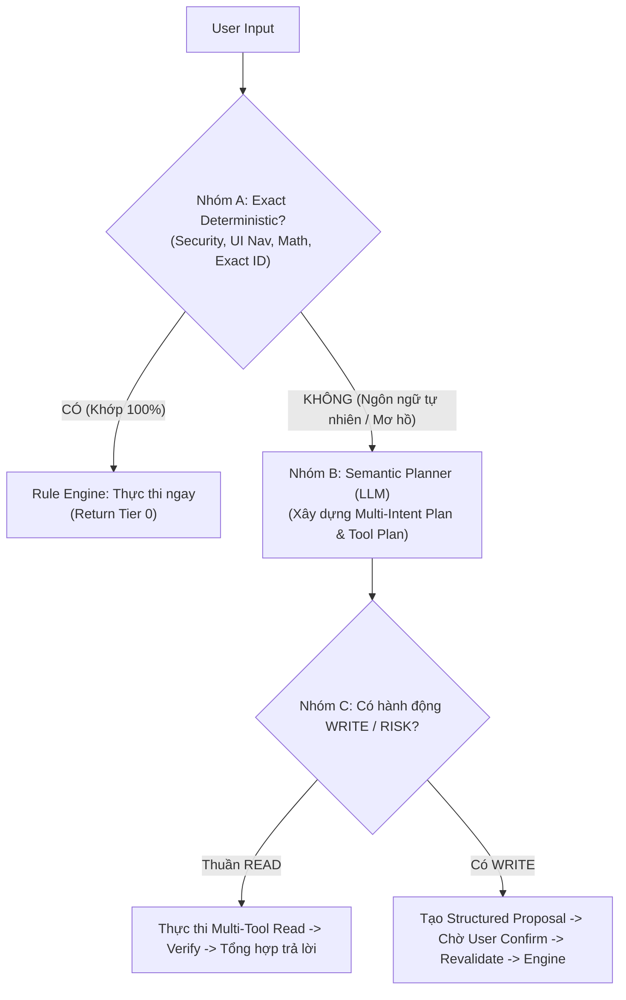
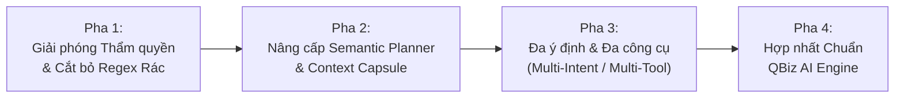

# QBiz Kho — AI POST-AUDIT ARCHITECTURE DECISION
**Quyết định Kiến trúc Trợ lý AI QBiz Kho & Kế hoạch Chuyển đổi (Migration Plan)**
*Chế độ: ARCHITECTURE ONLY / NO CODE / NO TEST / NO PATCH / NO PUSH / NO DEPLOY*
*Căn cứ: Báo cáo Thẩm định Thực tế `docs/QBIZ_KHO_AI_ARCHITECTURE_TRUTH_AUDIT.md` và Bài học Kiến trúc từ QBiz Connect/Core/Assistant*

---

## 1. ĐỌC VÀ TIẾP THU TRUTH AUDIT

Từ kết quả thẩm định thực tế mã nguồn tại `docs/QBIZ_KHO_AI_ARCHITECTURE_TRUTH_AUDIT.md`:

```
CURRENT_PIPELINE=User Input -> Debounce -> Context Envelope -> Router (222+ Early Returns & Regex Matching) -> [If Missed] Local/Cloud Model -> Hardcoded Router Map -> Single Tool -> UI Render
AUTO_FIRST_DECISION_MAKER=TIER_0_RULE_ENGINE
LOCAL_AI_ROLE=UNTRUSTED_FALLBACK_JSON_EXTRACTOR
CLOUD_AI_ROLE=SECONDARY_FALLBACK_SIMULATOR_OR_API
LLM_IS_PRIMARY_REASONER=NO
AGENTIC_LOOP=NO
MULTI_TOOL_READ=NO
MULTI_INTENT_REASONING=NO
RULE_ENGINE_DOMINANCE=CRITICAL_ABSOLUTE (8.181 dòng, 513 câu lệnh return, 222 điểm thoát sớm)
EARLY_RETURN_BEFORE_LLM=CRITICAL_HIGH (222 return gates trước khi chạm tới provider dispatch)
RISK_GUARD_POSITION=DUAL (Pre-router injection/elevation guards + Pre-model keyword blockers)
MODEL_CAN_OVERRIDE_ROUTER=NO
MODEL_CAN_CHOOSE_TOOL=NO
MODEL_RECEIVES_FULL_CONTEXT=NO (Context Starvation: Model chỉ nhận tên màn hình và prompt thô)
TOP_5_ROOT_CAUSES=
1. Rừng regex Tier 0 khổng lồ (8.181 dòng) nuốt chửng >90% request trước khi Model được gọi.
2. Context starvation: Toàn bộ dữ liệu sản phẩm, tồn kho, sổ cái bị giấu kín khỏi LLM.
3. Xung đột từ khóa (substring collision): Câu hỏi tư vấn tương lai bị ngộ nhận thành báo cáo lịch sử.
4. Kiến trúc Single-Intent / Single-Tool không thể xử lý câu hỏi ghép (lời bao nhiêu + nên nhập gì).
5. Ép schema dưới 10 từ, triệt tiêu hoàn toàn khả năng suy luận và giải thích của Model.
```

---

## 2. BÀI HỌC KINH NGHIỆM TỪ HỆ THỐNG QBIZ (CONNECT / CORE / ASSISTANT)

1. **Nguyên nhân thất bại kinh điển trong QBiz Connect:**
   - QBiz Connect từng thất bại và gây ức chế cho người dùng khi áp dụng các bộ lọc cứng nhắc: *deterministic bypass LLM*, *word-count gate* (cho rằng câu ngắn dưới X từ thì không cần AI), *speech-act classifier* ép sai intent, và biến câu hỏi thông tin thuần túy (`READ`) thành hành động tạo việc (`TASK/WRITE`).
   - Căn bệnh cốt tử: **Dùng một từ khóa đơn lẻ để chốt ý định kinh doanh phức tạp** (Single-keyword business routing).
2. **Nguyên tắc phân định ranh giới:**
   - Rule Engine chỉ được nắm quyền phán quyết cuối cùng khi câu lệnh có **độ khớp chính xác (Exact match)** và **độ tin cậy tuyệt đối (Confidence = 100%)** thuộc về các hành vi máy móc (navigation, math, date normalization, security).
   - Mọi câu thoại tự nhiên, biểu cảm, mơ hồ, hoặc câu hỏi tư vấn **bắt buộc phải qua Semantic Planner**.
   - Tuyệt đối không dùng giả định: "Câu ngắn thì không cần AI".
   - Provider (Ollama, Gemini, OpenAI) **không được sở hữu business logic**. Provider chỉ là môi trường tính toán để chạy model.
   - Thao tác ghi dữ liệu (`WRITE`) bắt buộc phải thông qua `Proposal System`; các thao tác rủi ro cao phải có xác nhận (`Confirm`) và tái thẩm định dữ liệu trước khi commit (`Revalidate`).
   - Câu ghép gồm hai ý định đọc dữ liệu (`READ + READ`) **tuyệt đối không được coi là vi phạm an toàn** để kích hoạt Compound Guard chặn lại.
   - Trace minh bạch mục tiêu: `Route → Provider → Skill → Tool → Data → Verify → Answer`.

---

## 3. QUYỀN HẠN CỦA RULE ENGINE (PHÂN ĐỊNH 3 NHÓM)

Để chấm dứt tình trạng Rule Engine lấn át và gây tê liệt trí tuệ của Model, quyền hạn hệ thống được phân định thành 3 nhóm rõ rệt:



### A. Nhóm A: EXACT DETERMINISTIC (Thẩm quyền tuyệt đối của Rule Engine)
- **Phạm vi:**
  1. An ninh & Quyền hạn: Chặn Prompt Injection (`<script>`, SQL drop), Role Elevation, cố tình can thiệp đồng bộ dữ liệu.
  2. Điều hướng giao diện chuẩn xác: `"mở cài đặt"`, `"vào trang pos"`, `"chuyển sang kho hà đông"`.
  3. Bật/Tắt âm thanh: `"tắt tiếng"`, `"bật giọng đọc"`.
  4. Chuẩn hóa ngày giờ & Đơn vị cơ học: Chuyển `"hôm nay"`, `"tuần này"`, `"tháng trước"` thành Date ISO.
  5. Thao tác ID tuyệt đối: Tra cứu mã vạch chính xác (Barcode scan exact match), ID đơn hàng cụ thể.
- **Thực thi:** Rule Engine xử lý trực tiếp và kết thúc ngay mà không cần gọi LLM, tiết kiệm chi phí và độ trễ.

### B. Nhóm B: SEMANTIC NATURAL LANGUAGE (Thẩm quyền độc quyền của Semantic Planner)
- **Phạm vi:** Mọi câu hỏi ngôn ngữ tự nhiên về tình hình kinh doanh, tư vấn, phân tích, chiến lược hoặc câu hỏi ghép:
  - *"Tháng này tôi cần nhập những cái gì?"*
  - *"Tháng này tôi có lời bao nhiêu và tôi nên nhập những cái gì nhỉ?"*
  - *"Có nên nhập k?"*
  - *"Hàng nào bán chạy mà sắp hết?"*
  - *"Hôm nay buôn bán thế nào, có gì bất thường không?"*
- **Quy tắc bất di bất dịch:** CẤM TIỆT việc dùng regex/keyword đơn lẻ (như thấy chữ `"nhập"` + `"tháng này"`) để cướp quyền. Toàn bộ nhóm này **phải đi qua Semantic Planner (LLM)** để hiểu đúng ngữ nghĩa, phân rã ý định và chọn danh sách tools cần chạy.

### C. Nhóm C: WRITE / RISK (Thẩm quyền của Proposal & Risk Guard)
- **Quy tắc:**
  1. Semantic Planner hiểu intent và xây dựng tham số trước.
  2. Không được thực thi ghi DB tự động. Mọi lệnh sửa tồn, tạo phiếu, hủy đơn, đổi giá phải chuyển thành `Structured Proposal`.
  3. Risk Guard đánh giá mức độ rủi ro (`READ`, `SAFE_WRITE`, `HIGH_RISK_WRITE`).
  4. Người dùng bấm duyệt (`Confirm`) -> Hệ thống kiểm tra lại điều kiện biên (`Revalidate`) -> Engine commit vào cơ sở dữ liệu.

```
RULE_ENGINE_AUTHORITY=EXACT_DETERMINISTIC_ONLY
SEMANTIC_PLANNER_AUTHORITY=PRIMARY_REASONER_FOR_ALL_NATURAL_LANGUAGE
RISK_GUARD_POSITION=POST_PLAN_PRE_EXECUTION
```

---

## 4. MODEL PHẢI LÀ SEMANTIC PLANNER, KHÔNG CHỈ LÀ FORMATTER

Xóa bỏ hoàn toàn cơ chế đối xử với Model như một "bộ gõ điền JSON dưới 10 từ". Model phải là **Tổng công trình sư lập kế hoạch (Semantic Planner)**:

### Input Context tối thiểu truyền cho Model (`Context Capsule`):
1. **User Text:** Raw text người dùng gõ + chuỗi đã chuẩn hóa (loại bỏ telex typo).
2. **Context Snapshot:** Màn hình đang mở (`route/screen`), vai trò người dùng (`owner/cashier/warehouse`), kho đang chọn.
3. **Entity Context:** Sản phẩm đang mở trong modal (`current_product_id` kèm tên, SKU, tồn khả dụng, ngưỡng tối thiểu), đơn hàng đang chọn (`current_order_id`).
4. **Business Catalog Summary:** Danh sách rút gọn các sản phẩm và nhóm hàng chính của shop (Top 20 sản phẩm bán chạy, sản phẩm dưới định mức an toàn).
5. **Time Context:** Mốc thời gian thực hiện (Timestamp hiện tại, ngày đầu tháng, ngày đầu tuần).
6. **Tool Registry Schemas:** Danh sách các tools khả dụng kèm mô tả ngắn và tham số yêu cầu (ví dụ: `get_profit_summary`, `explain_replenishment`, `check_stock`, `get_daily_overview`).
7. **Short Conversation Memory:** 2-3 lượt hội thoại gần nhất để giải quyết đại từ thay thế (*"cái này"*, *"kho kia"*, *"món vừa rồi"*).

### Output Structured Plan tối thiểu từ Model:
Thay vì trả về 1 chuỗi intent đơn lẻ, Model phải trả về một Kế hoạch Hành động Ngữ nghĩa (`Semantic Plan`):
```json
{
  "thought_summary": "Người dùng muốn biết lợi nhuận tháng này và nhận gợi ý các mặt hàng cần nhập thêm.",
  "intents": [
    {
      "id": "intent_1",
      "type": "READ",
      "domain": "FINANCE",
      "action": "query_profit",
      "tool": "get_profit_summary",
      "params": { "period": "month" }
    },
    {
      "id": "intent_2",
      "type": "READ",
      "domain": "INVENTORY",
      "action": "replenishment_advice",
      "tool": "replenishment_suggestion",
      "params": { "warehouseId": "all", "limit": 5 }
    }
  ],
  "composition": "SEQUENTIAL_AGGREGATE",
  "clarification_needed": false,
  "confidence": 0.95
}
```

---

## 5. MULTI-INTENT + MULTI-TOOL (XỬ LÝ CÂU HỎI KÉP)

### Đối chiếu ca điển hình:
*"Tháng này tôi có lời bao nhiêu và tôi nên nhập những cái gì nhỉ"*

1. **Trước đây (Bị lỗi):**
   - Không có bộ tách liên từ `"và"`.
   - Router thấy chữ `"lời bao nhiêu"` liền kích hoạt `isProfitQuery()` và dừng lại tại dòng 6020.
   - Trả lời doanh thu/giá vốn, vế hỏi nhập hàng bị mất tích hoàn toàn.
2. **Kiến trúc mục tiêu (Chuẩn hóa):**
   - Semantic Planner nhận diện được 2 ý định độc lập:
     - **Mục tiêu A:** Xem lợi nhuận tháng này (`get_profit_summary`).
     - **Mục tiêu B:** Xem danh sách hàng cần nhập (`replenishment_suggestion`).
   - Cả hai đều thuộc loại `READ` -> Risk Guard cho phép chạy tuần tự / song song.
   - Hệ thống thực thi Tool A -> lấy số liệu lãi lỗ.
   - Hệ thống thực thi Tool B -> lấy danh sách hàng dưới định mức tồn.
   - Response Composer tổng hợp cả 2 nguồn dữ liệu vào một câu trả lời mạch lạc:
     > *"📊 **Tình hình kinh doanh tháng này:** Lợi nhuận gộp ước tính đạt **15.200.000 VNĐ** (tỷ suất 24%).*  
     > *📦 **Khuyến nghị nhập hàng:** Hiện có **3 mặt hàng** đang chạm ngưỡng an toàn cần bổ sung ngay: Áo thun cổ tròn (còn 2), Nước khoáng Lavie (hết hàng)..."*

```
TARGET_MULTI_INTENT_REASONING=YES (Semantic decomposition into intents[])
TARGET_MULTI_TOOL_READ=YES (Parallel or sequential multi-read execution)
TARGET_PLANNER_LOOP=SINGLE_PLAN_MULTI_EXECUTE (Plan 1 lần -> Chạy N tools -> Composer trả lời)
```

---

## 6. RISK GUARD — ĐẶT ĐÚNG VỊ TRÍ KIẾN TRÚC

Thay vì đặt các regex "Multi-Intent Block" chặn họng người dùng trước khi phân tích ý định, Risk Guard phải được chuyển về **SAU bước lập kế hoạch và TRƯỚC bước thực thi công cụ**:

```
[ User Input ]
      │
      ▼
[ Understand & Semantic Plan ] (Xác định rõ user muốn làm gì: intent A, intent B)
      │
      ▼
[ Risk Classification ] (Phân loại cấp độ từng intent)
      ├─ READ + READ         ──> [ CHO PHÉP ]: Chạy các read tools và tổng hợp dữ liệu.
      ├─ READ + WRITE        ──> [ TÁCH ĐÔI ]: Thực thi READ để hiển thị; biến WRITE thành Proposal chờ duyệt.
      ├─ WRITE + WRITE       ──> [ TÁCH ĐÔI ]: Yêu cầu xác nhận từng hành động hoặc tạo Compound Proposal có review từng dòng.
      └─ HIGH_RISK_WRITE     ──> [ BẮT BUỘC CONFIRM + REVALIDATE ]: Khóa kho, hủy đơn hàng loạt, chỉnh giá toàn bộ.
      │
      ▼
[ Execution & Data Verification ]
      │
      ▼
[ Answer Composition ]
```

---

## 7. VERIFIER / EVIDENCE — BẢO CHỨNG SỰ THẬT DỮ LIỆU

Sau khi Tool thực thi xong dữ liệu, hệ thống bắt buộc phải có bước **Evidence Verification** trước khi cho phép Model soạn câu trả lời, nhằm chống ảo giác (hallucination):

1. **Tenant / Shop Boundary Check:** Dữ liệu trả ra có đúng `shop_id` của phiên làm việc không? Có lẫn lộn shop khác không?
2. **Entity Consistency:** ID sản phẩm / mã đơn có thực sự tồn tại trong state không?
3. **Time-Range Check:** Thời gian lọc báo cáo có khớp với yêu cầu của user (tháng này vs tuần này) không?
4. **Context Freshness:** Số lượng tồn kho lấy ra có đúng phiên bản mới nhất (`version`) không?
5. **Write Invariant:** Nếu yêu cầu chỉ là `READ`, tuyệt đối không có bản ghi nào bị thay đổi trong IndexedDB / state.
6. **Contradiction Guard:** Nếu tồn khả dụng = 0 mà câu trả lời lại khẳng định "còn hàng" -> Verifier từ chối câu trả lời và yêu cầu format lại theo dữ liệu thực.

---

## 8. LOCAL / CLOUD PROVIDERS — PHÂN ĐỊNH TRÁCH NHIỆM

1. **Loại bỏ hoàn toàn Business Logic trong Provider:**
   - Xóa bỏ việc viết các hàm if/else đặc thù của QBiz Kho bên trong adapter hay gateway.
   - Provider chỉ đóng vai trò là **Inference Engine** (gửi prompt/context capsule -> nhận về JSON Semantic Plan).
2. **Một Plan Contract duy nhất (Universal Plan Contract):**
   - Dù chạy qua **Local AI (Ollama qwen3.5:2b)**, **Gemini 2.5 Flash**, **DeepSeek**, hay **OpenAI Compatible**, tất cả đều phải tuân theo đúng schema `SemanticPlan`.
3. **Nguyên tắc khi Provider gặp sự cố (Provider Failure):**
   - Khi Local AI bị timeout hoặc mất mạng: Chuyển sang Cloud Fallback (Gemini) để chạy lại cùng một contract.
   - Tuyệt đối **KHÔNG ĐƯỢC TỰ Ý ĐỔI INTENT** của người dùng sang một hành động deterministic khác (như lỗi biến câu hỏi tư vấn thành báo cáo lịch sử).
   - Nếu toàn bộ các provider đều không khả dụng: Trả về thông báo trung thực *"Hệ thống AI đang tạm thời mất kết nối với mô hình ngôn ngữ"* kèm các nút điều hướng hỗ trợ, không sinh câu trả lời giả mạo (Zero Silent Mock).

---

## 9. QUYẾT ĐỊNH ĐỘNG CƠ CHUNG (SHARED ENGINE DECISION)

Đối chiếu với hạ tầng `qbiz-ai-engine` và `QBiz Core` hiện có tại Workspace:

### Bảng đánh giá 3 phương án:

| Tiêu chí | Phương án A: KEEP_KHO_ENGINE | Phương án B: ADOPT_SHARED_QBIZ_AI_ENGINE | Phương án C: HYBRID_MIGRATION |
| :--- | :--- | :--- | :--- |
| **Bản chất** | Giữ nguyên và tự vá víu router nội bộ của Kho | Đập bỏ toàn bộ, thay bằng `qbiz-ai-engine` ngay lập tức | **Chuẩn hóa kiến trúc Kho theo chuẩn chung, di chuyển theo 4 pha an toàn** |
| **Trùng lặp mã nguồn (Duplication)** | Cực lớn (duy trì 2 hệ thống provider, memory, policy độc lập) | Không trùng lặp | Giảm dần qua từng pha, hợp nhất contract |
| **Domain Isolation (Nghiệp vụ Kho)** | Tốt nhất cho kho | Rủi ro làm loãng logic đặc thù kiểm kho/POS | **Giữ nguyên 100% 34 Tools & 28 Skills chuyên sâu của Kho** |
| **Rủi ro Migration (Breakage Risk)** | Thấp ban đầu, nhưng nợ kỹ thuật phình to | Cực cao (Big-bang rewrite gây vỡ giao diện & POS) | **Rất thấp (Sửa delta, từng bước kiểm chứng, có thể rollback)** |
| **Khả năng kế thừa bài học Core/Connect** | Không kế thừa được | Kế thừa hoàn toàn | **Kế thừa triệt để bài học Semantic Frame & Resolvers** |

### Quyết định lựa chọn:
```
DECISION=C. HYBRID_MIGRATION
RATIONALE=
1. Phương án A bị bác bỏ vì không thể duy trì mãi một file router 8.181 dòng với 513 câu lệnh return; càng vá sẽ càng phát sinh lỗi xung đột từ khóa và không bao giờ thông minh được.
2. Phương án B bị bác bỏ vì rủi ro "Big-Bang" quá lớn, có thể phá vỡ hệ thống Dual-Host Deployment (Vercel/Netlify) và các tính năng POS/In hóa đơn đang chạy ổn định của Kho.
3. Phương án C (HYBRID_MIGRATION) là con đường tối ưu duy nhất: Giữ nguyên toàn bộ 34 Tools nghiệp vụ kho và 28 Skills đã được verify; chỉ phẫu thuật thay thế tầng Intent Router bằng Semantic Planner mỏng, chuẩn hóa Plan Contract theo chuẩn Universal Semantic Frame của QBiz AI Engine, đảm bảo hệ thống vừa thông minh vượt bậc vừa an toàn tuyệt đối.
```

---

## 10. ĐỊNH ĐOẠT SỐ PHẬN CÁC THÀNH PHẦN (COMPONENT FATE)

Bảng quyết định số phận các thành phần cũ trong `app/src/ai/`:

| Thành phần hiện tại | Định đoạt | Hành động kiến trúc cụ thể |
| :--- | :---: | :--- |
| **word-count gate** | **REMOVE** | Xóa bỏ tư duy "câu ngắn = không cần AI". Mọi câu ngắn mang tính nghiệp vụ ("có nên nhập k") phải được phân tích ngữ nghĩa. |
| **blanket deterministic read bypass** | **REMOVE** | Chấm dứt việc cho phép regex nuốt chửng các câu đọc dữ liệu tự nhiên trước khi LLM kịp nhìn thấy. |
| **single-keyword business routing** | **REMOVE** | Loại bỏ toàn bộ các điều kiện `pNorm.includes('nhap')`, `pNorm.includes('loi')` dùng đơn lẻ để chốt intent. |
| **early return trước semantic planning** | **RESTRICT** | Giảm từ 222 return xuống chỉ còn các check an ninh tuyệt đối (Security / Injection / Role elevation / Clear Navigation). |
| **compound guard trước intent decomposition**| **DEMOTE** | Di dời từ đầu file `router.js` về đứng SAU bước lập kế hoạch của Semantic Planner. Không chặn câu ghép `READ + READ`. |
| **single-intent-only flow** | **REMOVE** | Thay thế bằng mảng `intents[]` trong cấu trúc `SemanticPlan`. |
| **single-tool-only flow** | **DEMOTE** | Mở rộng cho phép Multi-Tool Read (chạy Tool A lấy doanh thu, Tool B lấy hàng tồn, ghép kết quả). |
| **provider-specific business logic** | **REMOVE** | Rút toàn bộ if/else nghiệp vụ ra khỏi `providers.js` và gateway, trả provider về đúng chức năng inference. |
| **fallback làm đổi intent** | **REMOVE** | Nghiêm cấm fallback tự tiện biến câu hỏi tư vấn tương lai thành báo cáo quá khứ; fallback chỉ được phép fallback model. |
| **mockGeminiFallback (giả danh Gemini)** | **REMOVE** | Xóa bỏ bộ keyword giả lập trong gateway; thông báo trung thực trạng thái kết nối của hệ thống. |
| **34 Business Tools & 28 Skills hiện có** | **KEEP** | Giữ nguyên 100% logic tính toán kho, công nợ, doanh thu, lợi nhuận trong `tools.js` và `skills.js`. |
| **Structured Proposal System** | **KEEP** | Giữ nguyên cơ chế tạo proposal và review card trước khi ghi dữ liệu. |
| **Floating Trigger & Responsive Sheet UI** | **KEEP** | Giữ nguyên giao diện trợ lý nổi, chip gợi ý và chuẩn hiển thị 390px/412px/1440px. |

---

## 11. SƠ ĐỒ GỌI MỤC TIÊU (TARGET CALL GRAPH)

```text
[ User Input (Text / Voice / Chip) ]
                │
                ▼
      [ Context Capsule Builder ]
(Snapshot: Route + Role + Active Product/Order + Catalog Summary + Tool Schemas)
                │
                ▼
  [ Exact Deterministic Gate (Tier 0) ]
  ├── Security / Injection / Elevation ──> [ Chặn & Log Audit ]
  └── Exact UI Navigation / Sound Toggle ──> [ Thực thi ngay & Return ]
                │ (Không khớp Exact)
                ▼
   [ Semantic Planner (Universal Plan Contract) ]
   (Gọi Ollama qwen3.5:2b / Cloud Gemini qua Payload chuẩn)
                │
                ▼
        [ Plan Validator ]
(Kiểm tra Schema: intents[], entities[], tool_plan[], confidence)
                │
                ▼
      [ Risk & Policy Guard ]
      ├── READ Intents  ──> [ Read Tool Executor (Hỗ trợ Multi-Tool) ]
      └── WRITE Intents ──> [ Write Proposal Builder (Tạo Proposal Card) ]
                │
                ▼
     [ Data / Evidence Verifier ]
(Kiểm tra: Tenant Isolation, Entity Version, Freshness, Contradiction)
                │
                ▼
    [ Response & Suggestion Composer ]
(Tổng hợp câu trả lời tiếng Việt tự nhiên, mạch lạc, chính xác số liệu)
                │
                ▼
  [ UI Render & Continuous Audit Loop ]
```

---

## 12. KẾ HOẠCH CHUYỂN ĐỔI 4 PHA (MIGRATION PLAN — NO CODE THIS TASK)

Kế hoạch thực thi gồm 4 pha rõ ràng, không làm gián đoạn hệ thống hiện tại:



### Pha 1: Giải phóng Thẩm quyền & Cắt tỉa Rừng Regex (Authority Re-alignment)
- **Mục tiêu:** Chấm dứt tình trạng Model bị "bịt miệng".
- **Hành động:**
  1. Giữ lại các Security Guards và Exact Navigation tại Tier 0.
  2. Cắt bỏ các substring matches thô bạo (như dòng 1654, 6493 đang cướp quyền câu hỏi nhập hàng).
  3. Mở thông đường dẫn từ `routeIntent()` xuống `dispatchCloudProvider()` cho mọi câu hỏi ngôn ngữ tự nhiên.
  4. Loại bỏ hàm `mockGeminiFallback` giả mạo trong `api/ai-gateway.js`.

### Pha 2: Nâng cấp Semantic Planner & Đóng gói Context Capsule
- **Mục tiêu:** Cung cấp đầy đủ dữ liệu cho Model suy luận thông minh.
- **Hành động:**
  1. Nâng cấp hàm `buildSafeProviderPayload()`: Gửi kèm tóm tắt danh mục sản phẩm (top bán chạy, sản phẩm hết hàng), tồn kho của sản phẩm đang mở, danh sách kho.
  2. Nâng cấp system prompt: Định nghĩa danh sách các Tools khả dụng và cách chọn tool.
  3. Chuẩn hóa output contract sang dạng `SemanticPlan` (chứa mảng `intents[]`).

### Pha 3: Triển khai Đa ý định & Đa công cụ (Multi-Intent / Multi-Tool Read & Composer)
- **Mục tiêu:** Giải quyết trọn vẹn các câu hỏi phức hợp như Case 2 ("lời bao nhiêu và nên nhập gì").
- **Hành động:**
  1. Xây dựng bộ điều phối `MultiToolExecutor`: Cho phép chạy tuần tự Tool 1 (`get_profit_summary`) và Tool 2 (`replenishment_suggestion`).
  2. Triển khai `ResponseComposer`: Ghép nối kết quả từ nhiều tools thành một câu trả lời hoàn chỉnh.
  3. Bổ sung tầng `EvidenceVerifier` kiểm tra tính toàn vẹn dữ liệu trước khi trả về UI.

### Pha 4: Hợp nhất Contract với QBiz AI Engine chung
- **Mục tiêu:** Đồng bộ kiến trúc toàn diện với toàn bộ hệ sinh thái QBiz.
- **Hành động:**
  1. Đồng bộ `SemanticFrame` của Kho với chuẩn của `qbiz-ai-engine`.
  2. Chia sẻ bộ từ điển thực thể chung (Universal Resolvers Contract cho Khách hàng, Sản phẩm, Thời gian).
  3. Tinh giản file `router.js` từ 8.181 dòng xuống dưới 1.000 dòng mã nguồn sạch, dễ bảo trì.

---

## 13. FINAL BLOCK (BẮT BUỘC)

```
CURRENT_ARCHITECTURE_VERDICT=IMPERATIVE_RULE_ENGINE_WITH_RARE_LLM_FALLBACK (8,181 lines, 513 returns, model starved and bypassed)
TARGET_ARCHITECTURE=SEMANTIC_PLANNER_WITH_TIER0_EXACT_GATES_AND_MULTI_TOOL_COMPOSER
RULE_ENGINE_AUTHORITY=EXACT_DETERMINISTIC_ONLY (Security, UI Navigation, Barcode exact, Mute/Unmute)
SEMANTIC_PLANNER_AUTHORITY=PRIMARY_REASONER_FOR_ALL_NATURAL_LANGUAGE
RISK_GUARD_POSITION=POST_PLAN_PRE_EXECUTION
TARGET_MULTI_INTENT_REASONING=YES (Semantic decomposition into intents[])
TARGET_MULTI_TOOL_READ=YES (Parallel or sequential multi-read execution)
TARGET_PLANNER_LOOP=SINGLE_PLAN_MULTI_EXECUTE (Plan once -> Execute N tools -> Verify -> Compose answer)
VERIFIER_REQUIRED=YES (Tenant boundary, entity version, freshness, no-write invariant)
MODEL_ROLE=PRIMARY_SEMANTIC_PLANNER (Deconstructs query, maps entities, selects tools)
PROVIDER_ROLE=PURE_INFERENCE_RUNTIME (Executes model; no business logic, no intent morphing on failure)
SHARED_ENGINE_DECISION=HYBRID_MIGRATION (Keep 34 Kho tools & 28 skills; adopt universal Semantic Plan contract; converge in 4 phases)
TOP_COMPONENTS_TO_KEEP=34_Business_Tools, 28_Domain_Skills, Structured_Proposal_System, Floating_Trigger_Sheet_UI, Audit_Logger
TOP_COMPONENTS_TO_DEMOTE_OR_REMOVE=8181_Line_Monolithic_Router, 222_Early_Regex_Returns, Single_Keyword_Intent_Hijackers, Pre_Planner_Multi_Intent_Blocker, Fake_Mock_Gateway_Simulator
MIGRATION_PHASE_COUNT=4
IMPLEMENTATION_READY=YES (Awaiting Owner approval before code execution)

CODE_CHANGE_COUNT=0
TEST_EXECUTION_COUNT=0
PUSH_COUNT=0
DEPLOY_COUNT=0

STOP.
Không sửa code.
Không chạy test.
Chờ Owner/ChatGPT duyệt kiến trúc trước.
```

LỆNH KHO — AI POST-AUDIT ARCHITECTURE DECISION.
